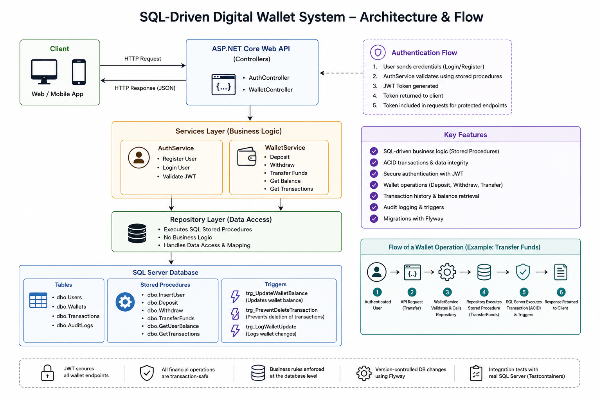

## 💳 SQL-Driven Digital Wallet System

A backend-only wallet system built with ASP.NET Core and SQL Server,
focused on transaction consistency, secure wallet operations,
and SQL-driven business logic.

---

## Architecture Overview

The system uses a layered backend architecture:

```text
Client
↓
ASP.NET Core API (Authentication + Routing)
↓
Service Layer (Business Orchestration)
↓
Repository Layer
↓
SQL Server (Stored Procedures + Constraints)
```

- API is thin and stateless.
- Business logic is implemented in SQL stored procedures.
- Data integrity is enforced at the database level.

---

### Architecture Diagram



---

### Core Features

#### Authentication

- User registration and login.
- JWT-based authentication.
- Secure password hashing using BCrypt.

#### Wallet Operations

- Create user wallet on registration.
- Deposit funds.
- Withdraw funds.
- Transfer funds between wallets.
- Retrieve wallet balance.
- Retrieve transaction history.

---

### Authorization Model

- JWT tokens contain the authenticated UserId.
- API extracts user identity from the token.
- All wallet operations validate ownership in SQL Server.
- Users cannot access wallets that do not belong to them.

---

## Configuration

### JWT signing key (secrets, not appsettings.json)

The real `Jwt:Key` must never live in `appsettings.json` - it would end up
committed to git. `appsettings.json` only holds non-secret defaults
(`Issuer`/`Audience`/`ExpirationDays`); the actual key is configured via
.NET user secrets, and the app won't start without it.

**This key must be identical to the one configured in
[Wallet-Operations-Agent](../Wallet-Operations-Agent)** - that project
validates the JWTs this one issues, using the same key, issuer, and
audience. If you haven't generated one yet, do it from either project and
copy the same value into both.

```bash
# From this project's API folder
dotnet user-secrets init   # only if it doesn't already have a UserSecretsId
dotnet user-secrets set "Jwt:Key" "<the-same-key-as-the-Agent>"
```

If `Issuer` or `Audience` differ from the defaults already in
`appsettings.json` (`WalletApi` / `WalletApiUsers`), set those the same way:

```bash
dotnet user-secrets set "Jwt:Issuer" "..."
dotnet user-secrets set "Jwt:Audience" "..."
```

On Windows, user secrets are stored at:

```
%APPDATA%\Microsoft\UserSecrets\<UserSecretsId>\secrets.json
```

---

### Database Design

#### Core Tables

- `dbo.Users` - Stores registered system users and authentication data.
- `dbo.Wallets`- Stores wallet balances and wallet ownership per user.
- `dbo.Transactions` - Stores immutable financial transaction history.
- `dbo.AuditLogs` - Stores audit records for sensitive system operations.

#### Stored Procedures

- `dbo.InsertUser` - Creates a new user and automatically creates the user's wallet.
- `dbo.Deposit` - Safely deposits funds into a wallet inside a SQL transaction.
- `dbo.Withdraw` - Validates balance and withdraws funds atomically.
- `dbo.TransferFunds` - Transfers funds between wallets using transactional consistency.
- `dbo.GetUserBalance` - Retrieves the current wallet balance and wallet information.
- `dbo.GetTransactions` - Returns transaction history for a specific wallet.

#### Triggers

- `trg_UpdateWalletBalance` - Automatically updates wallet balances after transaction inserts.
- `trg_PreventDeleteTransaction` - Prevents physical deletion of financial transaction records.
- `trg_LogWalletUpdate` - Writes audit logs whenever wallet data is modified.

---

### Database Migrations

Database schema and stored procedures are managed using Flyway.

Migrations include:

- Tables
- Constraints
- Triggers
- Stored Procedures

Benefits:

- Version-controlled database changes.
- Repeatable deployments.
- Consistent environments across development and testing.

---

### Data Integrity

- Full ACID transaction support.
- Constraints enforce valid transaction types.
- Foreign keys ensure relational integrity.
- Concurrency handled using SQL locking where required.
- Financial operations use `BEGIN TRANSACTION / COMMIT / ROLLBACK`.
- XACT_ABORT prevents partial updates.
- Database triggers maintain wallet balance consistency.

---

### API Endpoints

#### Authentication

```text
POST /api/auth/register
POST /api/auth/login
```

#### Wallet Operations (JWT required)

```text
POST /api/wallet/deposit
POST /api/wallet/withdraw
POST /api/wallet/transfer
GET  /api/wallet/{id}/balance
GET  /api/wallet/{id}/transactions
```

---

### Testing

- Integration tests using real SQL Server containers (Testcontainers).
- End-to-end API testing.
- Authentication flow testing.
- Wallet operation testing.

---

### Tech Stack

- ASP.NET Core
- SQL Server
- T-SQL Stored Procedures
- Flyway Database Migrations
- JWT Authentication
- BCrypt Password Hashing
- xUnit
- Testcontainers

--- 

### Summary

This project demonstrates:

- Secure authentication with JWT.
- SQL-driven business logic.
- Transaction-safe wallet operations.
- Layered backend architecture.
- Database-focused backend design.
- Integration testing with a real database.